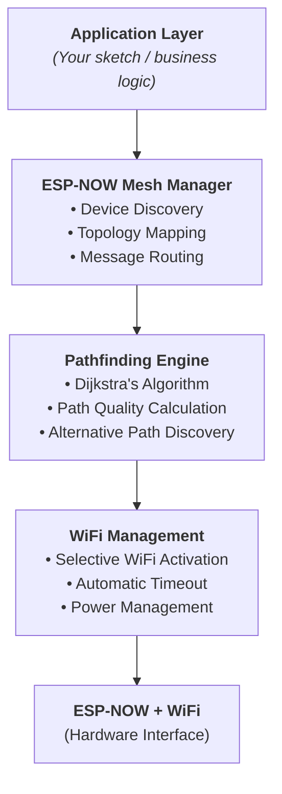

# ESPNowMesh

An ESP32 library that creates self-organizing mesh networks using ESP-NOW for topology discovery and dynamic WiFi activation for optimal communication pathways.

## Features

### Core Functionality
- **Periodic ESP-NOW Mesh Discovery**: Automatic device discovery using broadcast ESP-NOW messages
- **Mesh Config Synchronization**: Discovery packets carry runtime mesh settings so new nodes can converge automatically
- **Dynamic Pathfinding**: Dijkstra's algorithm for calculating optimal communication routes
- **Selective WiFi Activation**: Only enables WiFi on devices in the optimal path to conserve power
- **Signal Strength Monitoring**: RSSI-based quality assessment for intelligent routing decisions
- **Multi-hop Support**: Supports communication through intermediate relay devices
- **Device Management**: Automatic tracking and timeout of discovered devices

### Architecture

The library consists of three main components:



## Installation

1. **Copy library files** to your Arduino libraries directory:
   ```
   ~/Arduino/libraries/ESPNowMesh/
   ├── ESPNowMesh.h
   └── ESPNowMesh.cpp
   ```

2. **Include in your sketch**:
   ```cpp
   #include "ESPNowMesh.h"
   ```

3. **Compile** with Arduino IDE or PlatformIO for ESP32

## Quick Start

### Basic Setup

```cpp
#include "ESPNowMesh.h"

ESPNowMesh mesh;

void setup() {
  Serial.begin(115200);
  
  // Initialize mesh network
  mesh.begin("MyDevice");
  
  // Start periodic discovery
  mesh.startDiscovery();
}

void loop() {
  delay(1000);
  
  // Print network status
  mesh.printNetworkTopology();
}
```

### Finding and Using Optimal Paths

```cpp
// Assuming you know target device MAC address
uint8_t targetMAC[6] = {0x24, 0x0A, 0xC4, 0x12, 0x34, 0x56};

// Find optimal path
MeshRoute route = mesh.findOptimalPath(targetMAC);

if (!route.path.empty()) {
  // Enable WiFi for devices in this path (10 seconds)
  mesh.enableWiFiForPath(route, 10000);
  
  // Send data
  const char* msg = "Hello";
  mesh.sendData(targetMAC, (uint8_t*)msg, strlen(msg));
}
```

## API Reference

### Initialization

#### `void begin(const char* deviceName, uint8_t meshMaxDevices = 20, uint32_t meshDiscoveryInterval = 5000, int16_t meshRSSIThreshold = -85, uint8_t meshMaxHops = 10, uint32_t wifiEnableDuration = 10000, bool enableConfigSync = true)`
Initializes the ESP-NOW mesh network. Must be called once during setup.

**Parameters:**
- `deviceName`: Friendly name for this device (for debugging)

**Runtime config parameters:**
- `meshMaxDevices`: Maximum number of peers to track
- `meshDiscoveryInterval`: Discovery broadcast interval in milliseconds
- `meshRSSIThreshold`: Minimum RSSI for a peer to be accepted
- `meshMaxHops`: Maximum hop count used by the router
- `wifiEnableDuration`: How long WiFi stays enabled after a path is activated
- `enableConfigSync`: When `true`, the node requests and advertises mesh config during discovery

**Example:**
```cpp
mesh.begin("SensorNode-1");
```

---

### Mesh Config Sync

#### `MeshConfig getMeshConfig() const`
Returns the current runtime mesh configuration.

#### `void setMeshConfig(const MeshConfig& config, bool broadcast = true)`
Updates local mesh settings and optionally advertises them to peers.

#### `void requestMeshConfigSync()`
Broadcasts a config request so nearby nodes can reply with their active mesh settings.

**Behavior:**
- Discovery packets now carry config metadata automatically
- New nodes can adopt the first valid config they hear
- Calling `setMeshConfig()` lets one node act as the source of truth for the rest of the mesh

---

### Discovery

#### `void startDiscovery()`
Begins periodic discovery process. Devices will broadcast probes and collect responses.

**Interval:** 5 seconds (configurable via `MESH_DISCOVERY_INTERVAL`)

**Example:**
```cpp
mesh.startDiscovery();
```

#### `void stopDiscovery()`
Stops the periodic discovery process.

**Example:**
```cpp
mesh.stopDiscovery();
```

---

### Device Information

#### `std::vector<MeshDevice> getDevices()`
Returns list of all currently active devices in the mesh.

**Returns:** Vector of `MeshDevice` structures

**Example:**
```cpp
std::vector<MeshDevice> devices = mesh.getDevices();
for (const auto& dev : devices) {
  Serial.printf("Device RSSI: %d\n", dev.rssi);
}
```

#### `MeshDevice getDeviceInfo(const uint8_t* macAddress)`
Gets detailed information about a specific device.

**Parameters:**
- `macAddress`: 6-byte MAC address

**Returns:** `MeshDevice` structure

**Example:**
```cpp
MeshDevice info = mesh.getDeviceInfo(targetMAC);
Serial.printf("Signal: %d dBm, Hops: %d\n", info.rssi, info.hopCount);
```

#### `uint8_t getDeviceCount()`
Returns the number of devices currently in the mesh.

#### `int16_t getAverageSignalStrength()`
Returns the average RSSI across all devices.

#### `void getMyMAC(uint8_t* macBuffer)`
Gets this device's MAC address.

**Example:**
```cpp
uint8_t myMAC[6];
mesh.getMyMAC(myMAC);
Serial.printf("My MAC: %02X:%02X:%02X:%02X:%02X:%02X\n",
  myMAC[0], myMAC[1], myMAC[2], myMAC[3], myMAC[4], myMAC[5]);
```

#### `void printNetworkGraphML()`
Prints the network in a GraphML XML format to the serial.

**Example:**
```cpp
#include "ESPNowMesh.h"

ESPNowMesh mesh;

void setup() {
  Serial.begin(115200);
  
  // Initialize mesh network
  mesh.begin("MyDevice");
  
  // Start periodic discovery
  mesh.startDiscovery();
}

void loop() {
  delay(1000);
  
  // Print network status
  mesh.printNetworkGraphML();
}
```
---

### Pathfinding

#### `MeshRoute findOptimalPath(const uint8_t* destinationMAC)`
Calculates the optimal communication path to a destination using Dijkstra's algorithm.

**Parameters:**
- `destinationMAC`: 6-byte MAC address of target device

**Returns:** `MeshRoute` structure containing the path

**Algorithm:** 
- Considers signal strength (RSSI) as edge weights
- Prioritizes stronger signals and fewer hops
- Returns empty path if destination unreachable

**Example:**
```cpp
MeshRoute route = mesh.findOptimalPath(targetMAC);
if (!route.path.empty()) {
  Serial.printf("Path found: %d hops\n", route.hopCount);
}
```

#### `std::vector<MeshRoute> findAlternativePaths(const uint8_t* destinationMAC, uint8_t numPaths = 3)`
Finds multiple alternative paths for redundancy.

**Parameters:**
- `destinationMAC`: Target device MAC address
- `numPaths`: Number of alternative paths to find (default: 3)

**Returns:** Vector of `MeshRoute` structures sorted by quality

**Example:**
```cpp
auto altRoutes = mesh.findAlternativePaths(targetMAC, 2);
Serial.printf("Found %d alternative routes\n", altRoutes.size());
```

---

### WiFi Management

#### `void enableWiFiForPath(const MeshRoute& route, uint32_t durationMs = 10000)`
Activates WiFi on all devices in the optimal path for a specified duration.

**Parameters:**
- `route`: The route returned from `findOptimalPath()`
- `durationMs`: How long to keep WiFi enabled (default: 10000ms)

**Important:**
- Automatically disables WiFi after specified duration
- Use this before sending data via WiFi
- Conserves power by keeping WiFi off except when needed

**Example:**
```cpp
MeshRoute route = mesh.findOptimalPath(targetMAC);
mesh.enableWiFiForPath(route, 15000);  // WiFi on for 15 seconds
delay(2000);
// Send data via WiFi here
```

---

### Communication

#### `bool sendData(const uint8_t* destMAC, const uint8_t* data, uint16_t length)`
Sends data to a destination device via ESP-NOW.

**Parameters:**
- `destMAC`: 6-byte destination MAC address
- `data`: Pointer to data buffer
- `length`: Data length (max 200 bytes)

**Returns:** `true` if send was successful

**Note:** For actual WiFi communication, enable WiFi first using `enableWiFiForPath()`

**Example:**
```cpp
const char* msg = "Test";
if (mesh.sendData(targetMAC, (uint8_t*)msg, strlen(msg))) {
  Serial.println("Sent!");
}
```

---

### Callbacks

#### `void onMeshData(void (*callback)(const uint8_t*, const uint8_t*, uint16_t))`
Registers callback for received mesh data.

**Callback Parameters:**
- `sourceMac`: MAC address of sender
- `data`: Received data buffer
- `length`: Length of received data

**Example:**
```cpp
mesh.onMeshData([](const uint8_t* mac, const uint8_t* data, uint16_t len) {
  Serial.printf("Received %d bytes from device\n", len);
});
```

#### `void onDeviceDiscovered(void (*callback)(const MeshDevice& device))`
Registers callback when a new device is discovered.

**Example:**
```cpp
mesh.onDeviceDiscovered([](const MeshDevice& dev) {
  Serial.printf("New device found - RSSI: %d\n", dev.rssi);
});
```

#### `void onPathFound(void (*callback)(const MeshRoute& route))`
Registers callback when a path is successfully calculated.

**Example:**
```cpp
mesh.onPathFound([](const MeshRoute& route) {
  Serial.printf("Path found with %d hops\n", route.hopCount);
});
```

---

### Diagnostics

#### `void printNetworkTopology()`
Prints the current network topology to Serial (useful for debugging).

**Output:**
```
[MESH] Network Topology:
Devices: 3
Average Signal: -65 dBm
Devices:
  24:0A:C4:12:34:56 - RSSI: -60 dBm, Hops: 1
  24:0A:C4:12:34:57 - RSSI: -70 dBm, Hops: 2
  24:0A:C4:12:34:58 - RSSI: -75 dBm, Hops: 3
```

---

## Data Structures

### MeshDevice
```cpp
struct MeshDevice {
  uint8_t macAddress[6];      // Device MAC address
  int16_t rssi;               // Received Signal Strength
  uint32_t lastSeen;          // Timestamp of last detection
  uint8_t hopCount;           // Number of hops to device
  bool isActive;              // Currently active in network
  bool hasWiFiCapability;     // Can use WiFi for communication
};
```

### MeshRoute
```cpp
struct MeshRoute {
  std::vector<uint8_t*> path;  // Array of MAC addresses in route
  int16_t signalStrength;      // Overall path quality score
  uint8_t hopCount;            // Number of hops
  uint32_t timestamp;          // When route was calculated
};
```

---

## Configuration

Customize mesh behavior at runtime through `begin()` or `setMeshConfig()`:

```cpp
mesh.begin(
  "MyDevice",
  24,        // max devices
  3000,      // discovery interval
  -80,       // RSSI threshold
  8,         // max hops
  8000,      // WiFi enable duration
  true       // enable config sync
);
```

If you need to update a live mesh, call `setMeshConfig()` on one node and let the config broadcast propagate to the others.

---

## Power Optimization

This library is designed for power-constrained IoT devices:

1. **ESP-NOW only for discovery**: Uses low-power ESP-NOW for topology learning
2. **Selective WiFi**: Only enables WiFi when needed for actual data transfer
3. **Automatic timeouts**: WiFi automatically disables after communication window
4. **Device pruning**: Removes stale devices after 30 seconds of no contact

### Power-Saving Strategy

```cpp
// Most of the time: ESP-NOW only (~10mA)
mesh.startDiscovery();

// Every 30 seconds: Find optimal path
MeshRoute route = mesh.findOptimalPath(targetMAC);

// Only when sending: Enable WiFi briefly (~100-150mA)
mesh.enableWiFiForPath(route, 5000);  // 5 second window
mesh.sendData(targetMAC, data, length);
// WiFi auto-disables after 5 seconds
```

---

## Troubleshooting

### No devices discovered
- Ensure all ESP32s are powered and in range
- Check that `startDiscovery()` is being called
- Verify RSSI threshold isn't too high (MESH_RSSI_THRESHOLD)

### Path not found for known device
- Device may have gone out of range
- RSSI may be below threshold
- Call `printNetworkTopology()` to verify device is visible

### WiFi not enabling
- Check that `enableWiFiForPath()` is called with valid route
- Verify device has sufficient power for WiFi
- Check Serial output for error messages

### Memory issues
- Reduce `MESH_MAX_DEVICES` if tracking too many devices
- Increase stale device timeout for more aggressive cleanup

---

## Performance Characteristics

>*Untested for now* 

| Operation      | Time  | Power      |
|----------------|-------|------------|
| Discovery probe|`~10ms`| `~15mA`    |
| Pathfinding    |`~50ms`|`<5mA`      |
| WiFi enable    |`~1s`  |`~100-150mA`|
| ESP-NOW send   |`~20ms`|`~10-20mA`  |

---

## Limitations & Future Improvements

### Current Limitations
- Maximum 200 bytes per ESP-NOW message
- Max 20 devices tracked (configurable)
- Dijkstra's algorithm for pathfinding (can add A* for speed)
- No encryption (use HTTPS for sensitive data)

### Planned Features
- Multi-hop relaying for distant devices
- Network-wide time synchronization
- Encrypted mesh protocol
- Web dashboard for network visualization

---

## Example: Complete IoT Sensor Network

See the `examples/` directory for complete working examples:

1. **example1_basic_setup.ino** - Simple device discovery
2. **example2_pathfinding.ino** - Pathfinding with communication
3. **example3_multi_device.ino** - Complex multi-device network

---

## License

MIT License - See LICENSE file for details

---

## Support & Contribution

For issues, suggestions, or contributions, please visit the repository.

Happy meshing! 🚀
